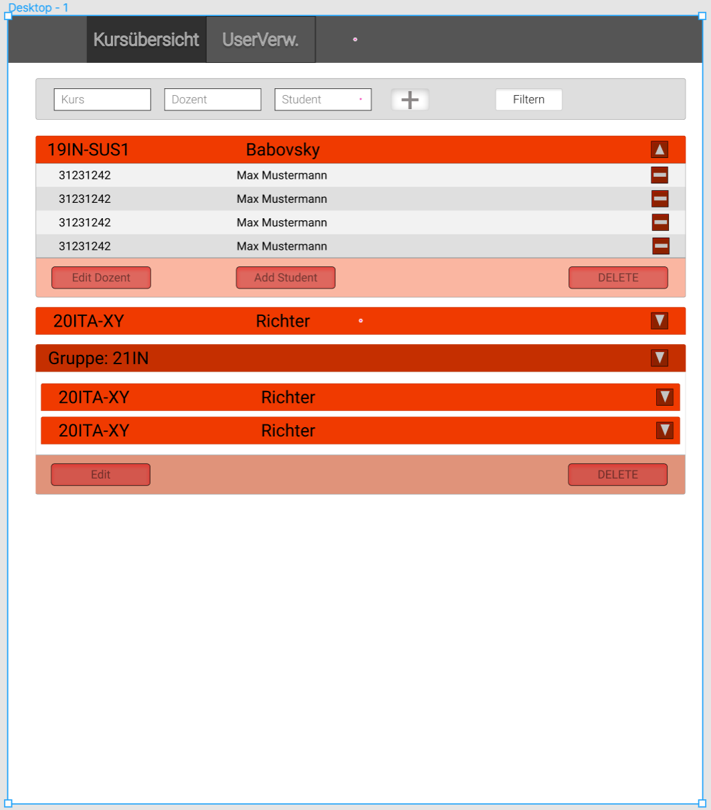
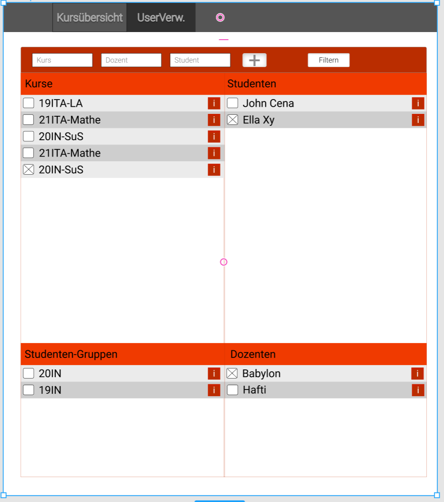

# Mockups
*Contains the Links to the Mockups for the HTML-Pages*

## Studenten:
* **Studentenseite**
    * Schreenshot:
    
* **Kurs**
    * Schreenshot:
    
* **Klausurübersicht**
    * Schreenshot:
    
    * Klausuren die mit anderen zusammenzählen gruppieren
    * Wie bei Admin-Kursübersicht (so ähnlich)
    * Gruppieren/Filtern nach Semester
## Dozenten:
* **Kursübersicht**
    * [Website (read-only)](https://www.figma.com/file/LieeU1zBl6X0NmMaoXKqJ8/Untitled?node-id=0%3A1)
    * Schreenshot:
    
    * Filten nach Jahrgang, ...
    * Kurzinfo ob noch Abgaben fehlen/Korrektur notwendig/fertig
* **Tasks**
    * Taskseite nur pro Kurs (Button "Anzeigen")
    * [Website (read-only)](https://www.figma.com/file/LieeU1zBl6X0NmMaoXKqJ8/Untitled?node-id=10%3A2)
    * Schreenshot:
    

## Admin/Sekreteriat:
* **Kursübersicht:**
    * [Website (read-only)](https://www.figma.com/file/HQCHNlbmD0fFJlmD9y4E0A/Untitled?node-id=1%3A3)
    * Schreenshot:
    

* **Userverwaltung**
    * [Website(read-only)](https://www.figma.com/file/HQCHNlbmD0fFJlmD9y4E0A/Untitled?node-id=1%3A132)
    * Schreenshot:
    
